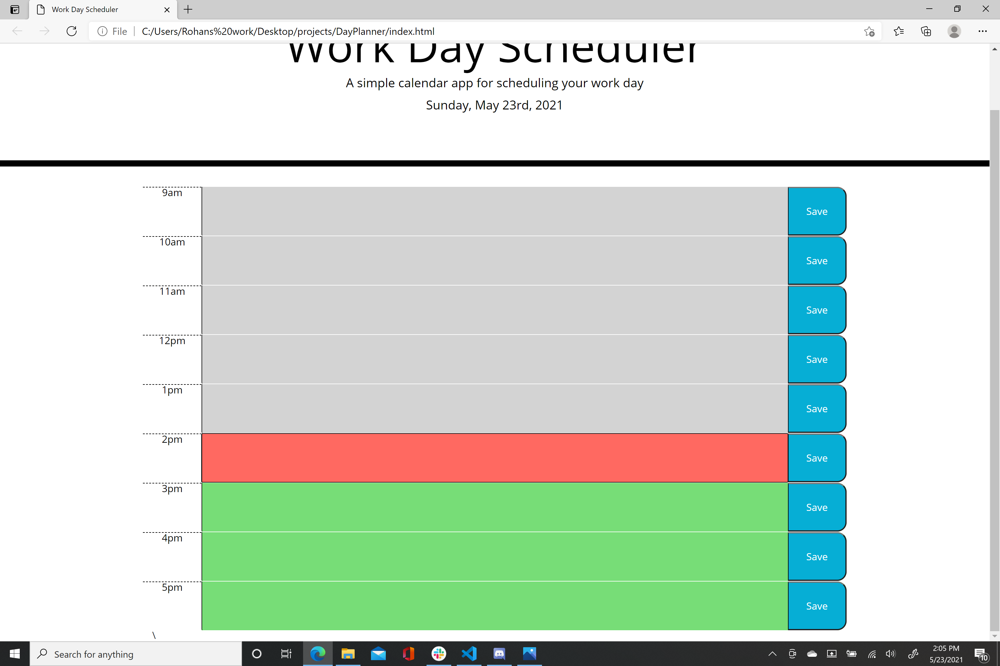
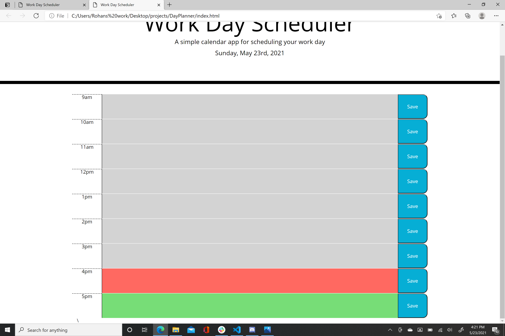

# DayPlanner
We were tasked with creating a day planner, that allows you to type activities for different hours throughout a workday. I was able to create a button as well as a textbox that allows you to type. I was also able to have there different hours change color throughout the day, it turns grey for past hours, red for the current hour and green for future hours.

I was unable to save any of the texts that were typed. 

Below are screenshots from the website

